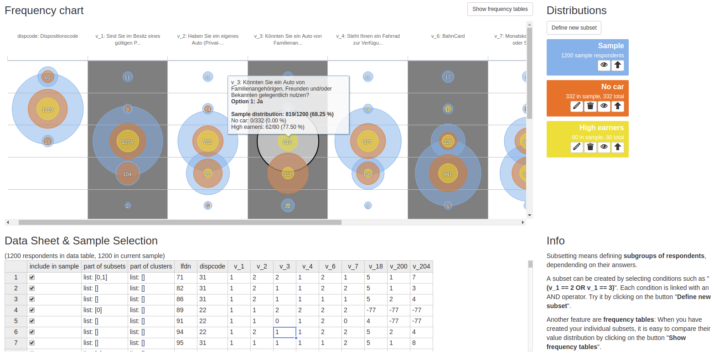

# Categorical data explorer

Client-sided visualization tool for categorical data (prototype). 

* Using Highcharts and Handsontable, the tool displays observations in the shape of a two-dimensional bubble chart. 
* It not only includes a chart, but also a corresponding table view for exploring the underlying raw data. 
* Users can interactively define new subsets and include them in the chart.
* Furthermore the tool includes an SPSS-style contingency table view to display subset proportions. 

## Live demo

Find the demo here: [http://www.nilsole.net/else/github/cat_cluster/index.html](http://www.nilsole.net/else/github/cat_cluster/index.html)

 
## Technologies used

|Technology|Version|License|Link
| ---------------------------- | --------- | --------- | ---------
|colpick Color Picker|2.0.2|MIT/GPL|[GitHub](https://github.com/josedvq/colpick-jQuery-Color-Picker)
|IcoMoon (font)||CC BY 3.0|[Website](http://keyamoon.com/icomoon/)
|Underscore.js|1.7.0|MIT|[Website](https://underscorejs.org/)
|Handsontable|0.10.2|MIT|[Website](https://handsontable.com/) 
|Highcharts JS|4.0.4|[Details](https://github.com/highcharts/highcharts/blob/master/license.txt)|[Website](https://www.highcharts.com/)
|jQuery|1.11.1|MIT|[Website](https://jquery.com/)
|jQuery UI|1.11.2|MIT|[Website](https://jqueryui.com/)
|Bootstrap|3.3.1|MIT|[Website](https://getbootstrap.com/)

## Future plans

This project dates back to 2014/2015 and needs some improvements. Such as:

* Turn into a webpack
* Thereby: Restructure and clarify / update dependencies
* Consider using a CSS preprocessor 
* Simplify and improve codebase
* Make JSON data file generator available
* Add documentation / how-to guide

## Author

Nils Glück ([LinkedIn](https://www.linkedin.com/in/nils-gl%C3%BCck-60a959121) / [GitHub](https://github.com/NilsOle/))